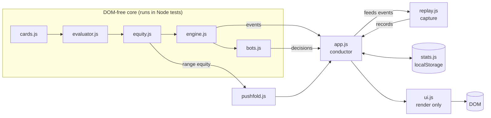

# Architecture

Poker Sparring is a static web app: vanilla HTML/CSS/JS, **zero runtime
dependencies**, no build step, no backend. The live site is GitHub Pages serving
the `main` branch.

## Module map

```
js/cards.js       Card primitives. Card = { r: 2..14, s: 0..3 }.
js/evaluator.js   7-card evaluator. Score = category * 16^5 + kickers (integer compare).
js/equity.js      Monte Carlo equity vs random hands AND vs a defined range
                  (estimateEquityVsRange), madeStrength() [0,1], detectDraws(),
                  holeTier() 1..6.
js/engine.js      PokerTable class. Owns ALL game rules: blinds/antes, betting
                  rounds, all-ins, side pots, showdown, odd chips. Emits events
                  via onEvent AND a queued eventQueue.
js/bots.js        ARCHETYPES + botDecide(table, player) -> { a, amount } | null.
js/pushfold.js    Push/fold drill scenarios + feedback. Facing-a-shove verdicts
                  use range equity against the shover's archetype tiers.
js/stats.js       localStorage stats (guarded so it loads in Node).
js/replay.js      Hand-history capture + replay state machine (DOM-free).
                  startHandRecord/recordHandAction/recordHandStreet/
                  finishHandRecord build a JSON record per finished hand;
                  replayState(rec, upto) + frameIndexForStreet() drive the
                  viewer. Storage: ps_hands_v1, last 50, newest first.
js/ui.js          DOM rendering ONLY. Never makes game decisions.
js/app.js         Conductor: event pump, hero controls, tournament flow,
                  coach tips, leak detection, stats recording.
```

**Layering rule:** `cards → evaluator → equity → engine → bots` are DOM-free and
must stay that way. They run in Node tests today and are written to be reused by
a React Native port later. `ui.js`/`app.js` are browser-only.



## Data flow (one hand)

1. `app.js` creates a `PokerTable` and calls `startHand()`.
2. The engine emits synchronous events (`handStart`, `action`, `actionTaken`,
   `street`, `handEnd`). `app.js` queues them and drains the queue with animation
   delays (`pump()`), so bot "thinking" time never blocks the engine. `app.js`
   also feeds each event into `js/replay.js`, which builds a per-hand record
   (blinds/antes synthesized from `totalBet` at `handStart`, since the engine
   posts them without action events) and saves the last 50 to localStorage.
3. When the hero is to act, `app.js` pauses the pump, enables controls built from
   `table.legalActions(0)` — the UI never hand-rolls legality — and shows a coach tip.
4. Bot turns: `botDecide(table, player)` returns `{ a, amount }`; the engine
   validates and applies it via `table.act()`.
5. On `handEnd`, `app.js` records stats (only opponents actually dealt in) and
   runs leak detection on the hero's actions.

Key engine contract: for `bet`/`raise`, `amount` is the **total** bet target for
the street, not the increment.

## Cross-file pattern (no modules)

Classic `<script>` tags keep the app runnable from `file://`. In the browser,
cross-file references are globals; in Node each core file is a module, so every
core file has a guarded require block at top and `module.exports` at bottom:

```js
if (typeof module !== 'undefined' && module.exports) {
  var __ev = require('./evaluator.js');
  var evaluate7 = __ev.evaluate7;
}
```

When adding a cross-file call, add it to the guard block too.

## Testing strategy

Three layers, all runnable with `npm test`:

| Layer | Where | What |
|---|---|---|
| Unit + integration | `tests/test.js` (Node) | 954 tests: evaluator vectors, equity sanity, deterministic side-pot / odd-chip / full-hand scenarios, push/fold verdict consistency, bot move-legality sweep (999 decisions across all archetypes), stats recording, 300-hand engine soak with per-hand chip conservation |
| Component | `tests/component.test.js` (jsdom) | 25 tests: real `ui.js` rendering — HTML escaping of user input, single-render feedback, glossary accordions, bb/100 guard, leak tracker states |
| Live / E2E | `tests/smoke.js` + browser playtest | Boots the real app in jsdom and auto-plays full hands (bot autonomy, hero controls, push/fold screen) with zero JS errors; the human browser playtest covers feel and visual QA |

There are no runtime dependencies to integration-test against — the "live
dependency" layer is the browser itself, covered by the playtest checklist in
`docs/ROADMAP.md`.

## State & persistence

- All persistent state (stats, leak records, custom bots) lives in
  `localStorage`, guarded with try/catch so private-mode or Node never crashes.
- Schema is additive (`blankStats()` merged over stored JSON); old archetype ids
  degrade gracefully because name/emoji are stored alongside the record.
- A global error boundary in `app.js` logs a calm notice on unexpected errors
  instead of killing the table.

## Deployment

GitHub Pages, "Deploy from branch" (`main`, `/root`). Every push redeploys in
~1–2 minutes. Consequences of the static architecture: no server-side state, no
auth, no multiplayer — all documented as limitations in the README.

## Security notes

- All user-controlled strings (custom bot name/emoji/desc) go through
  `UI.escapeHtml` before `innerHTML` — covered by component tests.
- No secrets, no API keys, no backend to attack. The threat model is basically
  "don't XSS yourself," and that's tested.
